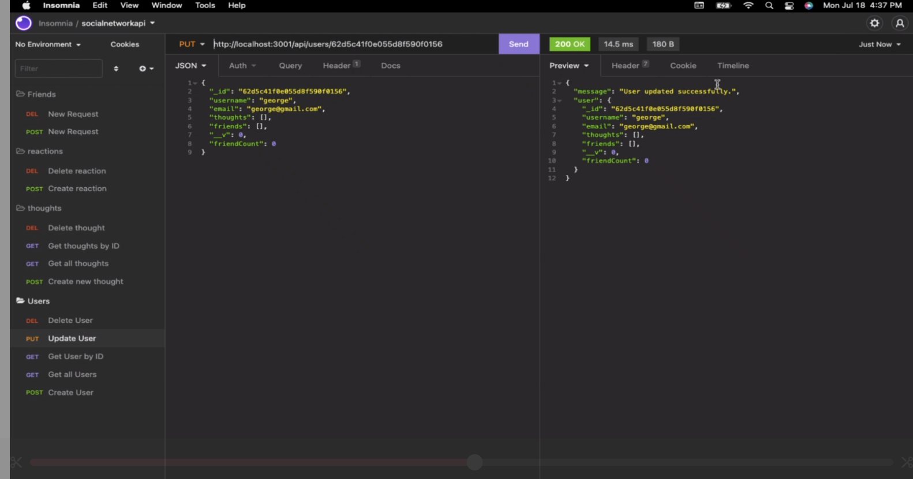

# Social Network API

## Table of Contents
* [Description](#Description)
* [Installation](#installation)
* [Usage](#Usage)
* [Credits](#credits)

## Description
        
An API for a social network web application where users can share their thoughts, react to friends’ thoughts, and create a friend list.

## Installation

You’ll use Express.js for routing, a MongoDB database, and the Mongoose ODM. In addition to using the Express.js and Mongoose packages, you may also optionally use a JavaScript date library of your choice or the native JavaScript Date object to format timestamps.

## Usage

View walk through video here -  

## Credits

[Greg Chambers](https://github.com/Gcoder9/socialnetworkapi) updated this code to follow accessibility standards.
